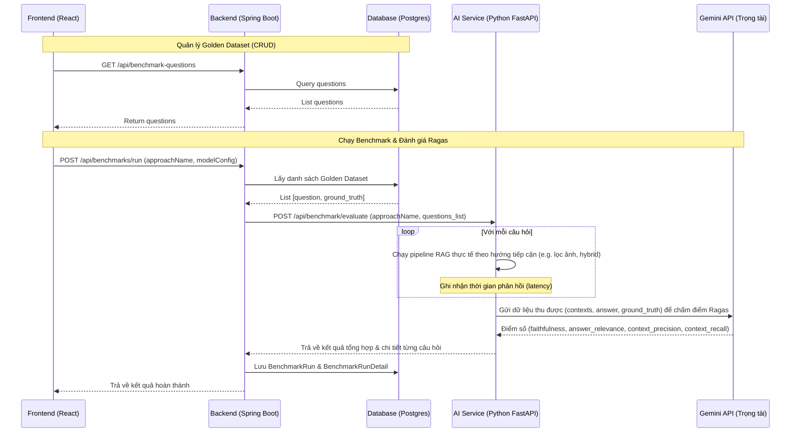

# Kế hoạch triển khai tích hợp Ragas Đánh giá & So sánh RAG trong Mora (Cập nhật)

Tài liệu này chi tiết hóa phương án thiết kế hệ thống đánh giá chất lượng RAG sử dụng **Ragas** và mô hình trọng tài **Gemini 2.5 Flash**, lưu trữ Golden Dataset trong database Postgres và cho phép so sánh các hướng tiếp cận/thuật toán khác nhau (ví dụ: xử lý hình ảnh, hybrid search, v.v.).

---

## 1. Kiến trúc luồng nghiệp vụ & Dữ liệu



---

## 2. Thiết kế Cơ sở dữ liệu (Database Schema)

Chúng ta sẽ tạo các bảng sau trong Postgres:

### Bảng `benchmark_question` (Golden Dataset)
- `id` (UUID/Long, PK)
- `question` (Text) - Câu hỏi kiểm thử.
- `ground_truth` (Text) - Câu trả lời chuẩn xác làm mẫu.
- `created_at`, `updated_at` (Timestamp)

### Bảng `benchmark_run` (Lịch sử & Kết quả tổng quan)
- `id` (UUID/Long, PK)
- `approach_name` (Varchar) - Tên hướng tiếp cận (e.g., `With_Image_Filtering`, `Baseline_Chunk_500`).
- `ragas_faithfulness` (Double) - Điểm trung thực trung bình.
- `ragas_answer_relevance` (Double) - Điểm liên quan trung bình.
- `ragas_context_precision` (Double) - Điểm chính xác ngữ cảnh trung bình.
- `ragas_context_recall` (Double) - Điểm phủ ngữ cảnh trung bình.
- `avg_latency_ms` (Long) - Thời gian phản hồi trung bình.
- `run_at` (Timestamp)

### Bảng `benchmark_run_detail` (Chi tiết từng câu hỏi trong lượt chạy)
- `id` (UUID/Long, PK)
- `run_id` (FK -> `benchmark_run.id`)
- `question` (Text)
- `retrieved_contexts` (Text) - Các văn bản truy xuất được.
- `generated_answer` (Text) - Câu trả lời do hệ thống sinh ra.
- `latency_ms` (Long) - Thời gian phản hồi của câu này.
- `faithfulness`, `answer_relevance`, `context_precision`, `context_recall` (Double) - Điểm chi tiết.

---

## 3. Các thay đổi đề xuất (Proposed Changes)

### 3.1. AI Service (Python FastAPI)

#### [MODIFY] [requirements.txt](file:///d:/Desktop/mora/mora-ai/requirements.txt)
- Thêm `ragas>=0.1.0`, `pandas`, `datasets`, `google-genai` (nếu chưa có).

#### [NEW] [benchmark_service.py](file:///d:/Desktop/mora/mora-ai/app/services/benchmark_service.py)
- Triển khai logic chạy pipeline RAG cho từng câu hỏi tùy thuộc vào cấu hình hướng tiếp cận (`approach_name`).
- Tích hợp Ragas Evaluator sử dụng mô hình **Gemini 2.5 Flash** (`gemini-2.5-flash`) làm LLM chấm điểm.

#### [NEW] [benchmark_endpoint.py](file:///d:/Desktop/mora/mora-ai/app/api/v1/endpoints/benchmark.py)
- Route POST `/api/benchmark/evaluate` nhận danh sách câu hỏi test và thực thi đánh giá.

---

### 3.2. Backend (Spring Boot Java)

#### [NEW] [BenchmarkQuestion.java](file:///d:/Desktop/mora/mora-backend/src/main/java/com/mora/backend/model/entity/BenchmarkQuestion.java) & [BenchmarkQuestionRepository.java](file:///d:/Desktop/mora/mora-backend/src/main/java/com/mora/backend/repository/BenchmarkQuestionRepository.java)
- Entity và JPA Repository cho tập dữ liệu Golden Dataset.

#### [NEW] [BenchmarkRun.java](file:///d:/Desktop/mora/mora-backend/src/main/java/com/mora/backend/model/entity/BenchmarkRun.java), [BenchmarkRunDetail.java](file:///d:/Desktop/mora/mora-backend/src/main/java/com/mora/backend/model/entity/BenchmarkRunDetail.java)
- Các Entity đại diện cho kết quả chạy đánh giá.

#### [NEW] [BenchmarkQuestionController.java](file:///d:/Desktop/mora/mora-backend/src/main/java/com/mora/backend/controller/BenchmarkQuestionController.java)
- Controller CRUD tập câu hỏi kiểm thử.

#### [NEW] [BenchmarkController.java](file:///d:/Desktop/mora/mora-backend/src/main/java/com/mora/backend/controller/BenchmarkController.java)
- Controller thực thi chạy benchmark và so sánh kết quả giữa các `approach_name`.

---

### 3.3. Frontend (React)

#### [NEW] [BenchmarkPage.tsx](file:///d:/Desktop/mora/mora-frontend/src/pages/admin/BenchmarkPage.tsx)
- Quản lý Golden Dataset (Thêm, Sửa, Xóa câu hỏi kiểm thử).
- Giao diện kích hoạt chạy Benchmark (nhập tên hướng tiếp cận).
- Biểu đồ so sánh (Bar Chart/Radar Chart) đối chiếu hiệu năng và độ chính xác của các lần chạy khác nhau.

---

## 4. Cách sử dụng thực tế & Hướng dẫn kiểm thử

### 4.1. Cách sử dụng thực tế
1. **Tạo Bộ câu hỏi kiểm thử**: Truy cập mục **Admin -> Benchmark -> Dataset** trên UI, thêm khoảng 5 - 10 câu hỏi cốt lõi cùng câu trả lời mong muốn (`ground_truth`).
2. **Đánh giá Hướng tiếp cận A (ví dụ: Không lọc ảnh)**:
   - Trên UI, nhấn **Chạy thử nghiệm**, đặt tên hướng tiếp cận là `No_Image_Filtering`.
   - Hệ thống chạy và trả về các điểm số (ví dụ: Faithfulness: 0.75, Latency: 2.1s).
3. **Đánh giá Hướng tiếp cận B (ví dụ: Có lọc ảnh trước khi gửi LLM)**:
   - Trên UI, nhấn **Chạy thử nghiệm**, đặt tên hướng tiếp cận là `With_Image_Filtering`.
   - Hệ thống chạy và trả về điểm số mới (ví dụ: Faithfulness: 0.88, Latency: 1.6s).
4. **So sánh đối chiếu**: Trên UI so sánh, chọn `No_Image_Filtering` và `With_Image_Filtering`, giao diện hiển thị bảng và biểu đồ so sánh sự chênh lệch rõ rệt.

### 4.2. Hướng dẫn kiểm thử & chạy thử nghiệm (Test Verification)
- **Chạy thử nghiệm API Python**:
  Sử dụng cURL hoặc Postman để kiểm tra tính năng chấm điểm bằng Ragas độc lập:
  ```bash
  curl -X POST "http://localhost:8000/api/benchmark/evaluate" \
       -H "Content-Type: application/json" \
       -d '{"approach_name": "test_run", "dataset": [{"question": "Mora là ai?", "ground_truth": "Mora là trợ lý học tập."}]}'
  ```
- **Chạy Integration Test trên Backend**:
  Kiểm tra lưu trữ kết quả benchmark vào cơ sở dữ liệu thông qua REST API của Spring Boot.
